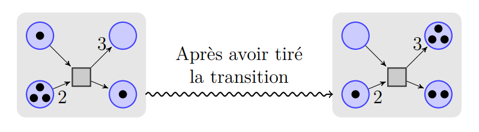

***Groupe A- Binôme 6***

## PetriNet
Un réseau de Petri est composé de places (représentées par des cercles) qui peuvent contenir des
jetons et de transitions (représentées par des carrés). Des arcs (porteurs d’une valeur) relient
les places aux transitions (arcs sortants des places) et les transitions aux places (arcs entrants
dans des places). Sans précision, la valeur d’un arc est par défaut 1.
Une transition est tirable lorsque les places qui y sont reliées par un arc entrant contiennent au
moins autant de jetons qu’indiqué par la valeur de l’arc. Quand une transition est tirée (un pas),
on enlève des jetons des places en amont de la transition selon les indications des arcs sortants
(des places) et on ajoute des jetons dans les places en aval selon les indications des arcs y entrants.
Le nombre total de jetons peut donc changer d’un pas à l’autre.
Le schéma qui suit montre un réseau de Petri avant que la transition soit tirée et après qu’elle a
été tirée.

## Système
À travers l'UML (Langage de Modélisation Unifié), un système a été implémenté qui permet de créer un réseau de Petri. Il est possible d'ajouter ou de supprimer des places, des transitions et des arcs, ainsi que de modifier leurs attributs ou d'obtenir des informations sur eux. Le système fournit également une méthode pour activer l'ensemble du système.
## Les codes et UMLs
Dans le code réel, nous avons remplacé les attributs et les méthodes de chaque classe par des noms en anglais.

Le code implémente toutes les méthodes de chaque classe présentes dans le diagramme de classes, et les relations entre les classes sont également reflétées dans le code : par exemple, PetriNet implémente concrètement les méthodes définies dans l'interface IPetriNet, et Arc_videur ainsi qu'Arc_zero héritent tous deux de la classe Arc.

## Test
Junit a été utilisé comme outil de test. Pour chaque classe spécifique, des tests unitaires ont été effectués dans ./src/test et peuvent être exécutés indépendamment. Des vérifications ont également été effectuées pour différents cas limites.

## main.java
Dans main.java, un réseau Petri a été conçu. En l'exécutant, vous pouvez obtenir un exemple réel de PetriNet.

## Clone
Cloner ce dépôt sur votre machine locale :
git clone https://github.com/badr4y/PetriNet.git