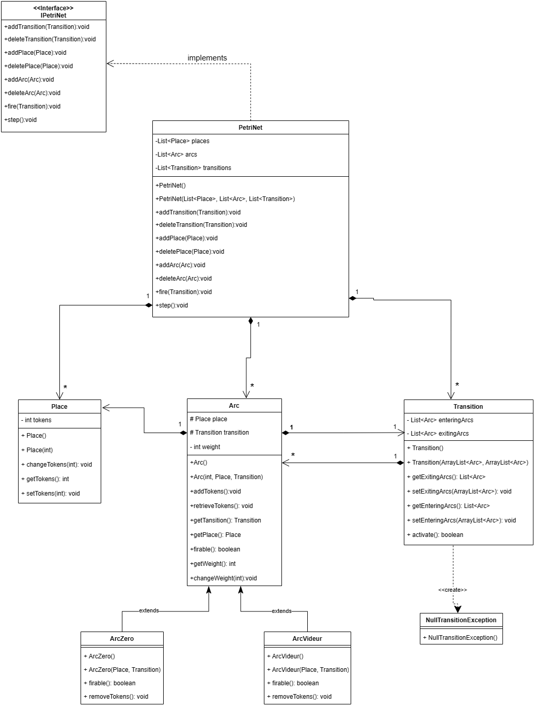

# PetriNet Java Project
PetriNet is a Java project that implements a simulation of a Petri Network.  
Petri Networks are mathematical modeling languages used for the description and analysis of systems.  
In this project, you can create Petri Nets, define places, transitions, and arcs(including special arcs such as ArcZero and ArcVideur).You can modify their properties and relationships, and also simulate the dynamic behavior of the system.


## Table of Contents

- [Getting Started](#getting-started)
    - [Prerequisites](#prerequisites)
    - [Installation](#installation)
- [Usage](#usage)
- [Project Structure](#project-structure)
- [Testing](#testing)
- [Comparison between the initial conception and the current one](#conception)

## Getting Started

### Prerequisites

Make sure you have the following prerequisites installed:
- Java Development Kit (JDK) - Version 17 （https://www.oracle.com/java/technologies/downloads/#java17)
- JUnit 5 (for tests) (https://junit.org/junit5/)
- Maven - Version 4.0.0 (Optional, if you want to use Maven for building and dependency management)

### Installation

1. Clone the repository:
```bash
   git clone https://github.com/badr4y/PetriNet.git 
   cd PetriNet
   mvn clean install
```

## Usage
Utilize the classes and interfaces within this project to model and simulate systems using Petri Networks. Begin by instancing a PetriNet and subsequently incorporating places, transitions, and arcs. Simulate the system's behavior by either firing a specific transition or executing a step that triggers all firable transitions in the Petri Network.

Upon exploring the code, you'll discover various methods for creating a complete Petri Network, catering to the user's preferences. However, we recommend the following ideal sequence:

- First, create lists for arcs, transitions, and places.
- Next, construct the PetriNet using its parametrized constructor, passing the aforementioned lists as parameters.
- Subsequently, create places, followed by transitions, and finally arcs.
Associate the arcs with the transitions.
- Lastly, add the arcs to the PetriNet, which will automatically include the associated places and transitions.

This structured approach ensures a coherent setup of the Petri Network, aligning with best practices."

Example :  
```
   Place place1 = new Place(3);
   Place place2 = new Place();
   Transition transition = new Transition(new ArrayList<>(),new ArrayList<>());
   Arc arc1 = new Arc(2,place1,transition);
   Arc arc2 = new Arc(3, place2, transition);
   transition.getEnteringArcs().add(arc1);
   transition.getExitingArcs().add(arc2);
   petriNet.addArc(arc1);
   petriNet.addArc(arc2);
```

## Project Structure
```
/PetriNet
  ├── src/                        # Source code directory
    ├── main/java/                # Main source code
      ├── petrinet.exceptions     # Package for PetriNet exception classes
      ├── petrinet.main           # Package for main PetriNet application classes
    ├── test/java/                # Test source code
      ├── petrinet.test           # Package for PetriNet test classes
  ├── .gitignore                  # Git configuration file specifying files and directories to ignore
  ├── pom.xml                     # Maven configuration file for managing the project
  └── README.md                   # Documentation file providing an overview of the project
```

## Testing
This project uses JUnit Jupiter for testing. For each specific class, we have conducted unit tests, and we have also verified different boundary conditions.

You can run the tests using the following command:
```
mvn clean test
```
In case of test failures, check the stack trace for any assertions or exceptions that caused the test to fail. If further investigation is required, you may run the tests in verbose mode using `mvn -X test` to get more detailed output.
## Comparison between the initial conception and the current one
- The first difference is that we translated the code to english, the names of the methods and variables, and the comments are all in english now.   
- We added getters to a number of attributes in different classes for their use in unit testing.  
- The method activate() in the class Transition that initially didn't have a return type now returns a boolean that returns true if the transition was activated and was thus firable and false if not.  
- We added the step() method for PetriNet class that fires all the transitions possible.  
- We overrode the retrieveTokens() method for the ArcZero class. Not overriding it was a mistake in the initial conception.  
- We defined a NullTransitionException that gets thrown if a null transition is activated.

This is the final UML class diagram :




